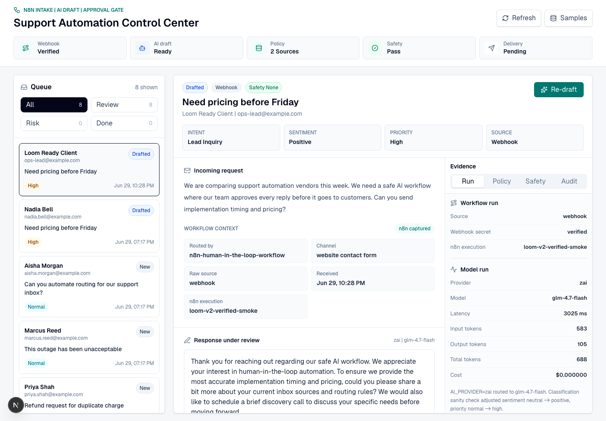
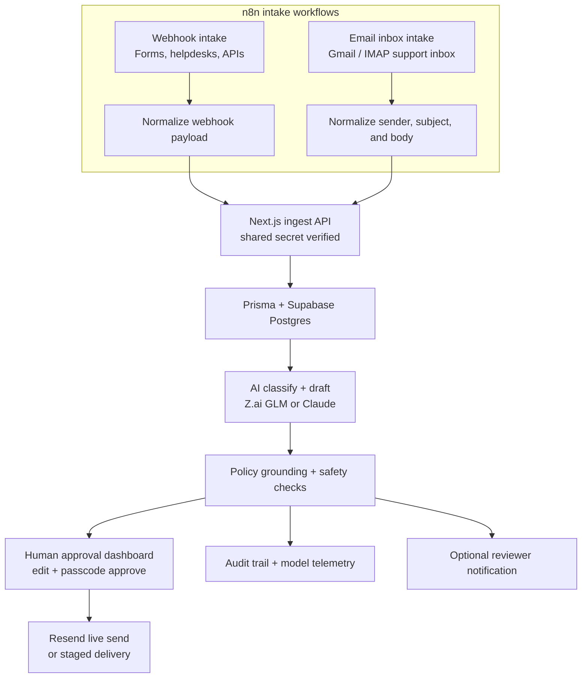
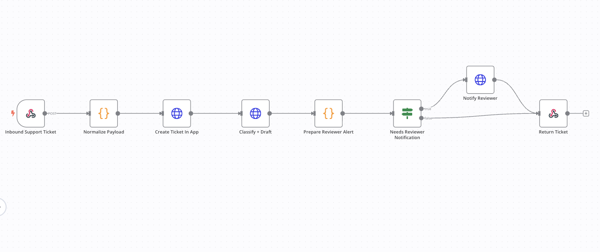
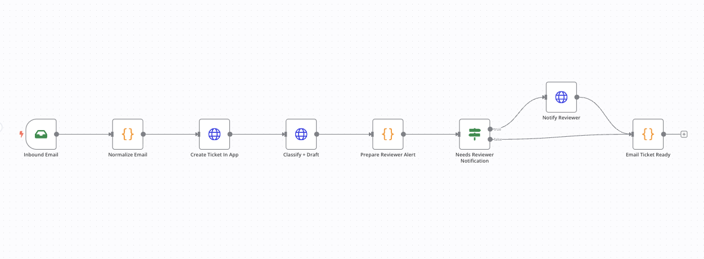

<div align="center">

# Support Automation Control Center

**AI drafts support replies. Humans approve before anything is sent.**

[](LICENSE)
[](https://github.com/mirasolutions06/support-automation-control-center/actions/workflows/ci.yml)


[Setup](docs/setup.md) · [Architecture](docs/architecture.md) · [n8n workflow](n8n/human-in-the-loop-support-agent.workflow.json)



</div>

## At a glance

This repo is a production-shaped support automation control center. It receives
support tickets or sales leads, drafts policy-grounded replies with AI, checks
for risky language, and stops at a reviewer dashboard so a human can edit and
approve the final message.

The app owns the approval workflow, policy grounding, safety checks, audit trail,
and delivery state. n8n owns intake from forms, inboxes, helpdesks, or custom
workflows.

| Path | What it contains |
| --- | --- |
| `src/app/` | Next.js dashboard and API routes for tickets, drafts, approvals, and sample data. |
| `src/lib/` | AI routing, policies, safety checks, validation, storage, email, and shared types. |
| `prisma/schema.prisma` | Postgres data model for tickets, drafts, audit events, and delivery state. |
| `data/policies/` | Local policy pack used to ground drafted replies. |
| `n8n/` | Importable webhook and email-inbox workflows. |
| `evals/` | Deterministic fixtures for classification, policy grounding, and safety behavior. |
| `docs/` | Setup, architecture, recording notes, and screenshots. |

## Overview

This repo is a production-shaped workflow automation template for:

- Support teams that want AI-drafted replies with human approval.
- Operations teams routing urgent, frustrated, or high-value inbound messages.
- AI automation projects that need auditability, policy grounding, and safe delivery controls.

Core outcome: the AI can classify and draft, but a human keeps the final send decision.

## Key Capabilities

- Webhook-first intake through n8n for forms, inboxes, helpdesks, or custom sources.
- Ticket persistence with Prisma and Supabase Postgres.
- Intent, sentiment, priority, and draft generation with Z.ai GLM or Claude.
- Policy-grounded drafting from a local policy pack with visible citations.
- Model telemetry for provider, model, latency, token usage, estimated cost, and route reason.
- Classification guardrails for obvious leads, refunds, angry complaints, and blocked technical issues.
- Draft safety checks for refund promises, legal admissions, angry tone, and missing escalation.
- Reviewer dashboard for editing, passcode approval, audit trail, and delivery state.
- Resend live email delivery when configured, with staged delivery fallback for local testing.
- Optional reviewer notification branch in n8n for high-priority or frustrated/angry tickets.
- Deterministic eval suite covering classification, policy retrieval, and safety behavior.

## Architecture / Workflow



The app owns the approval, policy, safety, telemetry, and delivery controls. n8n owns ingestion orchestration and external connector wiring. Both the webhook workflow and the email inbox workflow feed the same approval path.

## Tech Stack

- Next.js 16, React 19, TypeScript
- Tailwind CSS v4
- Prisma 6 and Supabase Postgres
- Z.ai GLM or Anthropic Claude
- Resend email delivery
- n8n workflow automation
- Zod validation
- Deterministic eval runner

## Local Setup

```bash
pnpm install
cp .env.example .env
pnpm db:generate
pnpm dev
```

Open `http://localhost:3000`. If that port is busy, Next.js may start on `http://localhost:3001`.

The app can run locally without external service credentials by using the in-memory fallback store, deterministic fallback drafts, and staged delivery. Add Supabase, AI provider, n8n, and Resend credentials when you want the full production path.

### Database

Create a Supabase project and set:

```bash
DATABASE_URL="postgresql://postgres.[PROJECT_REF]:[PASSWORD]@[REGION].pooler.supabase.com:6543/postgres?pgbouncer=true"
DIRECT_URL="postgresql://postgres.[PROJECT_REF]:[PASSWORD]@[REGION].pooler.supabase.com:5432/postgres"
```

Then push the schema:

```bash
pnpm db:push
```

If `DATABASE_URL` is missing or `DEMO_FORCE_MEMORY_STORE=true`, the app uses a local in-memory store for development.

## Environment Variables

Use `.env.example` as the source of truth. Key variables:

| Variable | Purpose |
| --- | --- |
| `NEXT_PUBLIC_APP_URL` | Public app URL used for links and local setup. |
| `APPROVAL_PASSCODE` | Passcode required to approve a customer response. |
| `N8N_WEBHOOK_SECRET` | Shared secret for n8n-to-app webhook verification. |
| `DATABASE_URL` / `DIRECT_URL` | Supabase Postgres connection strings. |
| `AI_PROVIDER` | `zai`, `anthropic`, or `fallback`. |
| `ZAI_API_KEY` / `ANTHROPIC_API_KEY` | Live model provider credentials. |
| `*_INPUT_COST_PER_1M` / `*_OUTPUT_COST_PER_1M` | Optional model cost estimates. |
| `RESEND_API_KEY` | Resend credential for live email delivery. |
| `RESEND_FROM_EMAIL` | Verified sender used by Resend. |
| `RESEND_LIVE_SEND` | Set `true` only after the sender domain is verified. |
| `REVIEWER_WEBHOOK_URL` | Optional n8n reviewer notification target. |
| `DEMO_FORCE_MEMORY_STORE` | Forces local memory storage for development. |

## AI Providers

Use Z.ai GLM:

```bash
AI_PROVIDER=zai
ZAI_API_KEY=...
ZAI_MODEL=glm-4.7-flash
ZAI_BASE_URL=https://api.z.ai/api/paas/v4
ZAI_THINKING=disabled
```

Use Claude:

```bash
AI_PROVIDER=anthropic
ANTHROPIC_API_KEY=...
ANTHROPIC_MODEL=claude-sonnet-4-6
```

If the selected provider is not configured or returns an error, the app records a deterministic fallback draft so the approval workflow remains testable.

## Policy Grounding

The local policy pack lives in `data/policies/support-policies.json`. During drafting, the app retrieves relevant policies, injects them into the model prompt, records citations in audit metadata, and shows the sources in the dashboard.

Included policy areas:

- Duplicate charge refund verification
- Customer incident escalation
- Safe automation lead discovery
- Technical support triage
- Human approval before customer delivery

A client implementation can replace the JSON policy pack with a CMS, Notion, Google Drive, help-center export, Supabase pgvector, or a managed vector database.

## n8n Workflow

Import `n8n/human-in-the-loop-support-agent.workflow.json` into n8n.



The workflow keeps n8n responsible for intake and orchestration, while the app owns ticket persistence, AI drafting, policy grounding, safety checks, audit logging, and human approval. The reviewer branch is intentionally optional: high-priority or frustrated/angry tickets can notify a human reviewer when `REVIEWER_WEBHOOK_URL` is configured, while normal tickets continue directly to the approval queue.

Set these n8n environment variables:

```bash
APP_BASE_URL=http://localhost:3000
N8N_WEBHOOK_SECRET=change-this-shared-secret
REVIEWER_WEBHOOK_URL=
```

Workflow path:

1. Receive inbound support ticket webhook.
2. Normalize the payload into the app ticket contract.
3. Create the ticket through `/api/tickets/ingest`.
4. Trigger `/api/tickets/:id/draft`.
5. Prepare reviewer routing metadata from priority and sentiment.
6. Branch to reviewer notification when configured and needed.
7. Notify the reviewer through `REVIEWER_WEBHOOK_URL`.
8. Return the drafted ticket to the webhook caller.

`REVIEWER_WEBHOOK_URL` is optional. When set, high-priority or frustrated/angry tickets send a reviewer alert with ticket details, classification, priority, sentiment, reason, and dashboard URL. When blank, the workflow skips notification and continues normally.

### Optional Email Inbox Trigger

Import `n8n/human-in-the-loop-support-agent.email-inbox.workflow.json` when you want real inbox intake.



This workflow watches an inbox with the n8n **Email Trigger (IMAP)** node, normalizes the email sender, subject, and body into the ticket contract, then uses the same create, draft, policy, safety, audit, and approval path as the webhook workflow.

Use this when you want an actual email to create a ticket. The Gmail account in the IMAP credential is the **support inbox n8n watches**. The person who sends an email to that inbox becomes the ticket customer, and approved replies are delivered back to that sender.

For a Gmail-based walkthrough:

1. Configure the IMAP credential with the support inbox, for example `support@example.com`.
2. Send a test email from the customer account to that support inbox.
3. Confirm the ticket appears in the Control Center with source `gmail`.
4. Approve the drafted response to send or stage the reply.

Gmail IMAP credential fields in n8n:

```bash
User: your Gmail address
Host: imap.gmail.com
Port: 993
SSL/TLS: true
Password: Gmail app password
```

When using Resend's test sender, send the test email **from the Resend account email** so the approved reply can be delivered by Resend's sandbox sender. For production, verify a sending domain in Resend and use a real support address.

## API Surface

| Endpoint | Purpose |
| --- | --- |
| `GET /api/tickets` | Returns tickets and audit events. |
| `POST /api/tickets/ingest` | Creates a ticket from n8n or another external source. |
| `POST /api/tickets/:id/draft` | Classifies and drafts with the configured model or fallback route. |
| `PATCH /api/tickets/:id` | Saves a human-edited final response. |
| `POST /api/tickets/:id/approve` | Approves the final response and sends or stages delivery. |
| `POST /api/samples/seed` | Loads local sample tickets for development. |

When `N8N_WEBHOOK_SECRET` is set, ingestion requests must include either:

```bash
x-n8n-webhook-secret: $N8N_WEBHOOK_SECRET
```

or:

```bash
Authorization: Bearer $N8N_WEBHOOK_SECRET
```

Example ingest payload:

```json
{
  "customerName": "Priya Shah",
  "customerEmail": "priya.shah@example.com",
  "subject": "Refund request",
  "body": "I was charged twice this morning.",
  "source": "webhook",
  "metadata": {
    "accountPlan": "Pro"
  }
}
```

## Evals and Verification

Run the deterministic eval suite:

```bash
pnpm evals
```

Current coverage:

- 6 classification, sentiment, priority, and policy grounding cases
- 4 safety cases for refund promises, legal admissions, angry tone, and missing escalation
- Expected result: `Passed 11 eval cases.`

Before shipping or deploying:

```bash
pnpm typecheck
pnpm lint
pnpm build
pnpm evals
```

## Deployment Notes

- Deploy the Next.js app to Vercel or another Node-compatible host.
- Use Supabase pooled connection strings for serverless runtime.
- Set `N8N_WEBHOOK_SECRET` in both the app and n8n before exposing the ingest endpoint.
- Keep `APPROVAL_PASSCODE` unique per deployment.
- Set model cost env vars from the current provider plan if cost reporting should reflect paid usage.
- Verify the Resend sender domain before setting `RESEND_LIVE_SEND=true`.
- Keep Gmail, Zendesk, Intercom, or other source-system credentials inside n8n or the source platform.
- Do not publish a live demo URL unless the deployment is protected or seeded only with non-sensitive demo data. The approval endpoint requires a passcode, but the demo dashboard and supporting review actions are intended for controlled walkthroughs, not untrusted public traffic.

## Docs

- [Setup guide](docs/setup.md)
- [Architecture notes](docs/architecture.md)
- [n8n workflow export](n8n/human-in-the-loop-support-agent.workflow.json)
- [Policy pack](data/policies/support-policies.json)
- [Eval fixtures](evals/fixtures/support-tickets.json)

Historical build notes remain in `docs/` for auditability, but this README is the main project entry point.

## License

MIT, see [LICENSE](LICENSE). Use it as a starting point for your own
human-approved support workflow.

## Contact

Built and operated by Mira Solutions, an AI engineering and automation studio.
mira.solutions06@gmail.com
