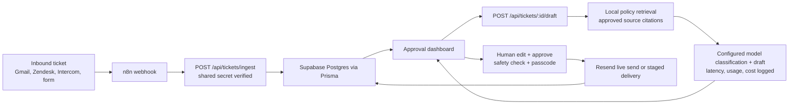

# Architecture

## Flow

## Responsibilities

- n8n owns ingestion and connector wiring.
- Next.js owns the dashboard, API, webhook verification, policy retrieval, approval gate, safety checks, model telemetry, and delivery adapter.
- Z.ai GLM or Claude owns classification and draft generation when the matching API key exists.
- The local policy pack grounds drafts in approved support, sales, and AI operations rules.
- Prisma owns Supabase Postgres persistence when `DATABASE_URL` exists.
- The memory store keeps local fallback runs working without external credentials.

## Data Model

- `Ticket`: customer details, source, status, classification, draft, final response, send result, metadata.
- `AuditEvent`: immutable timeline entries for ingest, draft, policy grounding, safety, edit, approval, send, telemetry, and fallback states.

## Production Notes

- Keep `APPROVAL_PASSCODE` unique per deployment.
- Set `N8N_WEBHOOK_SECRET` in both n8n and the app before exposing `/api/tickets/ingest`.
- Set optional `REVIEWER_WEBHOOK_URL` in n8n when high-priority or frustrated/angry tickets should alert a human reviewer outside the dashboard.
- Set model cost env vars from current provider pricing if dashboard cost estimates are needed.
- Replace `data/policies/support-policies.json` with the client's real policies before a production rollout.
- Set `RESEND_LIVE_SEND=true` only after the Resend sender domain is verified.
- Keep Gmail/Zendesk/Intercom credentials inside n8n or the source platform, not in the dashboard.
- Use Supabase connection pooling for deployed serverless environments if traffic grows.
